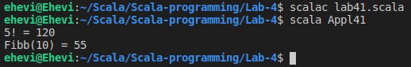

# Laboratorium 4.
## 1. Inferencja typu wyniku metody rekurencyjnej
### Plik scala41.scala:
```scala
object Appl41 {
  def factorial(n: Int): Int = {
    assert(n >= 0)
    if (n == 0 || n == 1) 1
    else n * factorial(n - 1)
  }

  def fibb(n: Int): Int = {
    assert(n >= 0)
    if (n == 0 || n == 1) n
    else fibb(n - 2) + fibb(n - 1)
  }

  def main(args: Array[String]) {
    println("5! = " + factorial(5))
    println("Fibb(10) = " + fibb(10))
  }
}
```

## 2. Elementarne algorytmy “tablicowe”: *iteracja* vs. *rekursja*
## 3. Rekursja - przepełnienie stosu
## 4. Rekursja “ogonowa”/końcowa, adnotacja *@tailrec*
## 5. Usprawnianie procesów rekurencyjnych: “*memoization*“ i wzorzec “*trampolina*“
## 6. Odwzorowanie `switch - case` (z Javy) w Scali (wariant z typem wyliczeniowym)
## 7. Constant patterns (vs. *variable patterns*)
## 8. Constructor patterns
## 9. Variable binding and pattern guards
## 10. Typed patterns
## 11. Typ `Option`
## 12. Ekstraktory
#### Zadanie
