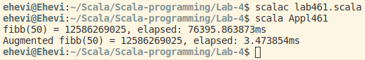
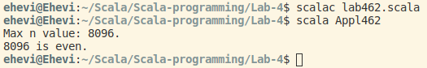

# Laboratorium 4.
## 1. Inferencja typu wyniku metody rekurencyjnej
#### `lab41.scala`:
```scala
object Appl41 {
  def factorial(n: Int): Int = {
    assert(n >= 0)
    if (n == 0 || n == 1) 1
    else n * factorial(n - 1)
  }

  def fibb(n: Int): Int = {
    assert(n >= 0)
    if (n == 0 || n == 1) n
    else fibb(n - 2) + fibb(n - 1)
  }

  def main(args: Array[String]) {
    println("5! = " + factorial(5))
    println("Fibb(10) = " + fibb(10))
  }
}
```


## 2. Elementarne algorytmy “tablicowe”: *iteracja* vs. *rekursja*
#### Zadanie
Uzupełnić definicje metod `sumArrayRec1` i `sumArrayRec2` (plik `lab42.scala`) tak, aby wszystkie testy "przechodziły pozytywnie" (miały status `OK`).
```scala
def sumArrayRec1(i: Int, elems: Array[Int]): Int = {
  if (i < elems.size) elems(i) + sumArrayRec1(i + 1, elems)
  else 0
}
  
def sumArrayRec2(elems: Array[Int]) = {
  val size = elems.size
  def goFrom(i: Int): Int = {
    if (i < size) elems(i) + goFrom(i + 1)
    else 0
  }
  goFrom(0)
}
```


#### Zadanie
Dodać zestawy testów oraz implementacje metod:
- [x] `sumSqrArrayIter` + `sumSqrArrayRec1` + `sumSrqArrayRec2` (suma kwadratów elementów tablicy)
```scala
def sumSqrArrayIter(elems: Array[Int]) = {
    var sum = 0
    for (i <- elems) sum += pow(i, 2).intValue
    sum
}

def sumSqrArrayRec1(i: Int, elems: Array[Int]): Int = {
    if (i < elems.size) pow(elems(i), 2).intValue + sumSqrArrayRec1(i + 1, elems)
    else 0
}

def sumSqrArrayRec2(elems: Array[Int]) = {
    val size = elems.size
    def goFrom(i: Int): Int = {
        if (i < size) pow(elems(i), 2).intValue + goFrom(i + 1)
        else 0
    }
    goFrom(0)
}
```

```scala
def main(args: Array[String]) {
    val a1To5 = (1 to 5).toArray
    println("Testing with a1To5 = " + a1To5.mkString("Array(", ", ", ") ..."))
    val expectResult = 55
    checkPredicate(sumSqrArrayIter(a1To5) == expectResult, "sumSqrArrayIter(a1To5) == " + expectResult)
    checkPredicate(sumSqrArrayRec1(0, a1To5) == expectResult, "sumSqrArrayRec1(0, a1To5) == " + expectResult)
    checkPredicate(sumSqrArrayRec2(a1To5) == expectResult, "sumSqrArrayRec2(a1To5) == " + expectResult)
}
```


- [x] `prodArrayIter` + `prodArrayRec1` + `prodArrayRec2` (iloczyn elementów tablicy)
```scala
def prodArrayIter(elems: Array[Int]) = {
    var prod = 1
    for (i <- elems) prod *= i
    prod
}

def prodArrayRec1(i: Int, elems: Array[Int]): Int = {
    if (i < elems.size) elems(i) * prodArrayRec1(i + 1, elems)
    else 1
}

def prodArrayRec2(elems: Array[Int]) = {
    val size = elems.size
    def goFrom(i: Int): Int = {
        if (i < size) elems(i) * goFrom(i + 1)
        else 1
    }
    goFrom(0)
}
```

```scala
def main(args: Array[String]) {
    val a1To5 = (1 to 5).toArray
    println("Testing with a1To5 = " + a1To5.mkString("Array(", ", ", ") ..."))
    val expectResult = 120
    checkPredicate(prodArrayIter(a1To5) == expectResult, "prodArrayIter(a1To5) == " + expectResult)
    checkPredicate(prodArrayRec1(0, a1To5) == expectResult, "prodArrayRec1(0, a1To5) == " + expectResult)
    checkPredicate(prodArrayRec2(a1To5) == expectResult, "prodArrayRec2(a1To5) == " + expectResult)
}
```


- [x] `sumAbsArrayIter` + `sumAbsArrayRec1` + `sumAbsArrayRec2` (suma wartości bezwzględnych elementów tablicy)

```scala
def sumAbsArrayIter(elems: Array[Int]) = {
    var sum = 0
    for (i <- elems) sum += i.abs
    sum
}

def sumAbsArrayRec1(i: Int, elems: Array[Int]): Int = {
    if (i < elems.size) elems(i).abs + sumAbsArrayRec1(i + 1, elems)
    else 0
}

def sumAbsArrayRec2(elems: Array[Int]) = {
    val size = elems.size
    def goFrom(i: Int): Int = {
        if (i < size) elems(i).abs + goFrom(i + 1)
        else 0
    }
    goFrom(0)
}
```

```scala
def main(args: Array[String]) {
    val aNegative1To5 = (-5 to -1).toArray
    println("Testing with aNegative1To5 = " + aNegative1To5.mkString("Array(", ", ", ") ..."))
    val expectResult = 15
    checkPredicate(sumAbsArrayIter(aNegative1To5) == expectResult, "sumAbsArrayIter(aNegative1To5) == " + expectResult)
    checkPredicate(sumAbsArrayRec1(0, aNegative1To5) == expectResult, "sumAbsArrayRec1(0, aNegative1To5) == " + expectResult)
    checkPredicate(sumAbsArrayRec2(aNegative1To5) == expectResult, "sumAbsArrayRec2(aNegative1To5) == " + expectResult)
}
```


#### Zadanie
Uzupełnić brakujące miejsca w pliku [`lab43.scala`](https://github.com/Ehevi/Scala-programming/blob/master/Lab-4/lab-files/lab43.scala), tak, aby wszystkie testy "przechodziły pozytywnie" (status `OK`); metody mają zwracać element o największej wartości.


## 3. Rekursja - przepełnienie stosu
#### Zadanie
Wyznaczyć maksymalny rozmiar tablicy, który nie powoduje przepełnienia stosu: [`lab44.scala`](https://github.com/Ehevi/Scala-programming/blob/master/Lab-4/lab-files/lab44.scala).
Czy otrzymany w wyniku powyższego testu rozmiar tablicy jest rzeczywiście maksymalny? Czy otrzymywane w kolejnych uruchomieniach wyniki są takie same?


## 4. Rekursja “ogonowa”/końcowa, adnotacja *@tailrec*
W pliku [`lab45.scala`](https://github.com/Ehevi/Scala-programming/blob/master/Lab-4/lab-files/lab45.scala) dodać adnotację `@tailrec` w definicji metody `sumArrayRec2`. Przanalizować wynik kompilacji. Czym różnią się metody `sumArrayRec2` i `sumArrayRec3`? Do czego służy parametr `acc`?


(https://www.scala-lang.org/api/2.12.3/scala/annotation/tailrec.html)

Metoda `sumArrayRec3` wykorzystuje rekurencję ogonową. Ostatnia operacja wykonywana przez funkcję to rekurencyjne wywołanie samej siebie (lub zwrócenie końcowego wyniku). Pozwala to kompilatorowi na jej optymalizację poprzez zastąpienie tego wywołania funkcji instrukcją skoku: rekurencja zastępowana jest iteracją. W ten sposób rekurencyjne wywołanie może korzystać z istniejącej już ramki, przez co zapotrzebowanie na stos maleje z liniowego O(n) do stałego O(1). W konsekwencji znacząco zredukowane jest ryzyko przepełnienia stosu (*stack overflow*). Wyraźnie zwiększa to wydajność działania.

W metodzie `sumArrayRec2` rekurencyjne wywołanie funckji nie jest jej ostatnią instrukcją, przez co nie spełnia ona warunków optymalizacji ogonowej.


Parametr `acc` przechowuje aktualny wynik wartości obliczanej przez funkcję.


#### Zadanie
W pliku [`lab42.scala`](https://github.com/Ehevi/Scala-programming/blob/master/Lab-4/lab-files/lab42.scala) dodać metodę `sumSqrArrayRec3` - z rekursją ogonową (dla potwierdzenia poprawności dodać `@tailrec`).

```scala
def sumSqrArrayRec3(elems: Array[Int]) = {
    val size = elems.size
    @tailrec
    def goFrom(i: Int, acc: Int): Int = {
        if(i < size) goFrom(i + 1, acc + pow(elems(i), 2).intValue)
        else acc
    }
    goFrom(0, 0)
}
```


#### Zadanie
W pliku [`lab41.scala`](https://github.com/Ehevi/Scala-programming/blob/master/Lab-4/lab-files/lab41.scala) dodać nowe wersje `factorial` i `fibb` - z rekursją ogonową (dla potwierdzenia poprawności dodać `@tailrec`).

```scala
def factorialTailRec(n: Int): Int = {
  assert(n >= 0)
  @tailrec
  def goFrom(i: Int, acc: Int): Int = {
    if(i == 0 || i == 1) acc
    else goFrom(i - 1, i * acc)
  }
  goFrom(n, 1)
}
```

```scala
def fibbTailRec(n: Int): Int = {
  assert(n >= 0)
  @tailrec
  def goFrom(i: Int, prev: Int, current: Int): Int = {
    if(i == 0) current
    else goFrom(i - 1, prev + current, prev)
  }
  goFrom(n, 1, 0)
}
```

#### Zadanie
W pliku [`lab42.scala`](https://github.com/Ehevi/Scala-programming/blob/master/Lab-4/lab-files/lab42.scala) dodać odpowiednie metody (z rekursją ogonową) dla `prodArrayRec3` i `sumArrayRec3`. Dla potwierdzenia poprawności dodać `@tailrec`.

```scala
def prodArrayRec3(elems: Array[Int]) = {
    val size = elems.size
    @tailrec
    def goFrom(i: Int, acc: Int): Int = {
        if(i < size) goFrom(i + 1, acc * elems(i))
        else acc
    }
    goFrom(0, 1)
}
```

```scala
def sumAbsArrayRec3(elems: Array[Int]) = {
    val size = elems.size
    @tailrec
    def goFrom(i: Int, acc: Int): Int = {
        if (i < size) goFrom(i + 1, acc + elems(i).abs)
        else acc
    }
    goFrom(0, 0)
}
```

## 5. Usprawnianie procesów rekurencyjnych: “*memoization*“ i wzorzec “*trampolina*“
[`lab461.scala`](https://github.com/Ehevi/Scala-programming/blob/master/Lab-4/lab-files/lab461.scala): skąd wynika tak duża różnica w czasie wykonania tych metod?



Różnica wynika z wykorzystania przez funkcję `fibCalc` techniki optymalizacyjnej *memoization*. "Ciężkie" obliczeniowo wartości są zapamiętywane i nie muszą być obliczane ponownie, kiedy kolejny raz trzeba z nich skorzystać.

#### Zadanie
Wyznaczyć maksymalną wartość `n`, która nie powoduje przepełnienia stosu ([`lab462.scala`](https://github.com/Ehevi/Scala-programming/blob/master/Lab-4/lab-files/lab462.scala))



### Wzorzec "trampolina": ([`lab463.scala`](https://github.com/Ehevi/Scala-programming/blob/master/Lab-4/lab-files/lab463.scala))


## 6. Odwzorowanie `switch - case` (z Javy) w Scali (wariant z typem wyliczeniowym)
#### `JavaAppl.java`:
```java
class JavaAppl {
  enum WeekDay {
    Mon, Tue, Wed, Thu, Fri, Sat, Sun
  }
  private static void printDayName(WeekDay day) {
    switch (day) {
      case Mon: System.out.println("Monday");
        break;
      case Tue: System.out.println("Tuesday");
        break;
      case Wed: System.out.println("Wednesday");
        break;
      case Thu: System.out.println("Thursday");
        break;
      case Fri: System.out.println("Friday");
        break;
      case Sat: System.out.println("Saturday");
        break;
      case Sun: System.out.println("Sunday");
        break;
      default: System.out.println("What the he...?!");
    }
  }
  public static void main(String[] args) {
    for (WeekDay day : WeekDay.values()) {
      printDayName(day);
    }
  }
}
```


#### `lab470.scala`:
```scala
object Appl470 {
  object WeekDay extends Enumeration {
    type WeekDay = Value
    val Mon, Tue, Wed, Thu, Fri, Sat, Sun = Value
  }
  
  import WeekDay._
  def printDayName(day: WeekDay) = {
    day match {
      case Mon => println("Monday")
      case Tue => println("Tuesday")
      case Wed => println("Wednesday")
      case Thu => println("Thursday")
      case Fri => println("Friday")
      case Sat => println("Saturday")
      case Sun => println("Sunday")
      case _   => println("What the he..?!")
    }
  }

  def main(args: Array[String]) {
    for (day <- WeekDay.values) printDayName(day)
  }
}
```


#### `lab470.scala` (modyfikacja metody `printDayName`):
```scala
object Appl470 {
  object WeekDay extends Enumeration {
    type WeekDay = Value
    val Mon, Tue, Wed, Thu, Fri, Sat, Sun = Value
  }
  
  import WeekDay._
  def printDayName(day: WeekDay) = day match {
      case Mon => println("Monday")
      case Tue => println("Tuesday")
      case Wed => println("Wednesday")
      case Thu => println("Thursday")
      case Fri => println("Friday")
      case Sat => println("Saturday")
      case Sun => println("Sunday")
      case _   => println("What the he..?!")
  }

  def main(args: Array[String]) {
    for (day <- WeekDay.values) printDayName(day)
  }
}
```


## 7. [Constant patterns](https://github.com/Ehevi/Scala-programming/blob/master/Lab-4/notebooks/7.%20Constant%20patterns.ipynb) (vs. *variable patterns*)

## 8. Constructor patterns
#### `lab471.scala`:
```scala
sealed abstract class Expr
case class Number(num: Double) extends Expr
case class UnOp(operator: String, arg: Expr) extends Expr
case class BinOp(operator: String, left: Expr, right: Expr) 
extends Expr

object ExprEval {
  def simplify(e: Expr): Expr = e match {
    case UnOp("+", Number(num)) => Number(num)
    case BinOp("+", Number(0), Number(num)) => Number(num)
    case _ => e
  }
  def evaluate(e: Expr): Double = ExprEval.simplify(e) match {
    case Number(num) => num
    case BinOp("+", left, right) => evaluate(left) + evaluate(right)
    case BinOp("-", left, right) => evaluate(left) - evaluate(right)
    case _ => println("Unmatched expression!"); 0
  }
}
object Appl471 {
  def main(args: Array[String]) {
    import ExprEval._

    println(simplify(UnOp("+", Number(10))))
    println(simplify(BinOp("+", Number(0), Number(32))))
    println(evaluate(BinOp("+", BinOp("+", Number(1.5), Number(5.5)), Number(3))))
    println(evaluate(BinOp("+", BinOp("-", Number(11), Number(6)), Number(9))))
  }
}
```


## 9. Variable binding and pattern guards
#### `lab471.scala`:
```scala
sealed abstract class Expr
case class Number(num: Double) extends Expr
case class UnOp(operator: String, arg: Expr) extends Expr
case class BinOp(operator: String, left: Expr, right: Expr) 
extends Expr

object ExprEval {
  def simplify(e: Expr): Expr = e match {
    case UnOp("+", Number(num)) => Number(num)
    case BinOp("+", Number(0), Number(num)) => Number(num)
    case UnOp("abs", el @ UnOp("abs", _)) => el
    case UnOp("abs", Number(num)) if(num >= 0) => Number(num)
    case UnOp("abs", Number(num)) if(num < 0) => Number(-num)
    case _ => e
  }
  def evaluate(e: Expr): Double = ExprEval.simplify(e) match {
    case Number(num) => num
    case BinOp("+", left, right) => evaluate(left) + evaluate(right)
    case BinOp("-", left, right) => evaluate(left) - evaluate(right)
    case _ => println("Unmatched expression!"); 0
  }
}
object Appl471 {
  def main(args: Array[String]) {
    import ExprEval._

    println(simplify(UnOp("+", Number(10))))
    println(simplify(BinOp("+", Number(0), Number(32))))
    println(evaluate(BinOp("+", BinOp("+", Number(1.5), Number(5.5)), Number(3))))
    println(evaluate(BinOp("+", BinOp("-", Number(11), Number(6)), Number(9))))
    println(simplify(UnOp("abs", UnOp("abs", Number(10)))))
    println(simplify(UnOp("abs", Number(10))))
    println(simplify(UnOp("abs", Number(-10))))
  }
}
```

## 10. [Typed patterns](https://github.com/Ehevi/Scala-programming/blob/master/Lab-4/notebooks/10.%20Typed%20patterns.ipynb)
## 11. [Typ `Option`](https://github.com/Ehevi/Scala-programming/blob/master/Lab-4/notebooks/11.%20Typ%20Option.ipynb)
## 12. [Ekstraktory](https://github.com/Ehevi/Scala-programming/blob/master/Lab-4/notebooks/11.%20Ekstraktory.ipynb)
